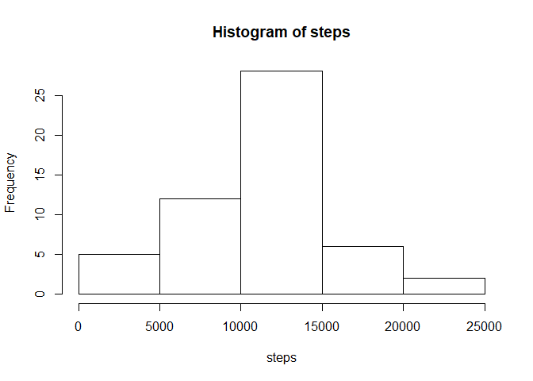
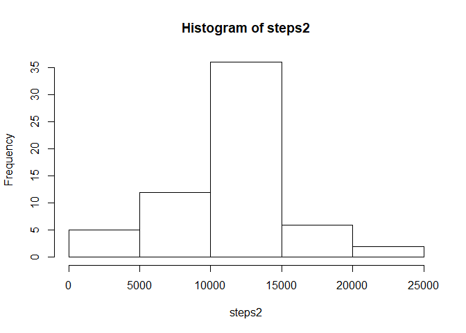
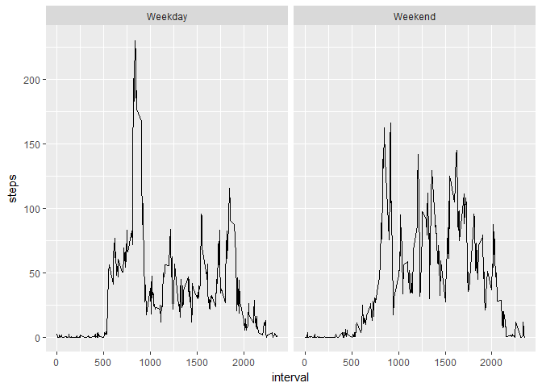

## Loading and preprocessing the data

```r
table <- read.csv("activity.csv")
```

## What is mean total number of steps taken per day?
First, we simply sum up the total number of steps taken on each date. 

```r
steps <- tapply(table$steps, table$date, sum)
steps
```

```
## 2012-10-01 2012-10-02 2012-10-03 2012-10-04 2012-10-05 2012-10-06 
##         NA        126      11352      12116      13294      15420 
## 2012-10-07 2012-10-08 2012-10-09 2012-10-10 2012-10-11 2012-10-12 
##      11015         NA      12811       9900      10304      17382 
## 2012-10-13 2012-10-14 2012-10-15 2012-10-16 2012-10-17 2012-10-18 
##      12426      15098      10139      15084      13452      10056 
## 2012-10-19 2012-10-20 2012-10-21 2012-10-22 2012-10-23 2012-10-24 
##      11829      10395       8821      13460       8918       8355 
## 2012-10-25 2012-10-26 2012-10-27 2012-10-28 2012-10-29 2012-10-30 
##       2492       6778      10119      11458       5018       9819 
## 2012-10-31 2012-11-01 2012-11-02 2012-11-03 2012-11-04 2012-11-05 
##      15414         NA      10600      10571         NA      10439 
## 2012-11-06 2012-11-07 2012-11-08 2012-11-09 2012-11-10 2012-11-11 
##       8334      12883       3219         NA         NA      12608 
## 2012-11-12 2012-11-13 2012-11-14 2012-11-15 2012-11-16 2012-11-17 
##      10765       7336         NA         41       5441      14339 
## 2012-11-18 2012-11-19 2012-11-20 2012-11-21 2012-11-22 2012-11-23 
##      15110       8841       4472      12787      20427      21194 
## 2012-11-24 2012-11-25 2012-11-26 2012-11-27 2012-11-28 2012-11-29 
##      14478      11834      11162      13646      10183       7047 
## 2012-11-30 
##         NA
```
We can easily see the distribution of total daily steps with a histogram of the above table.

```r
hist(steps)
```

<!-- -->

And we can quickly calculate the meand and median of daily steps.

```r
mean(steps, na.rm = TRUE)
```

```
## [1] 10766.19
```

```r
median(steps, na.rm = TRUE)
```

```
## [1] 10765
```

## What is the average daily activity pattern?
We can examine the average daily pattern of steps by averaging the steps taken for each interval, across all days, and then simply examine the steps taken over time throughout the day.

```r
library(ggplot2)
```

```
## Warning: package 'ggplot2' was built under R version 3.4.3
```

```r
dailyAverage <- aggregate(steps ~ interval, table, mean)
g <- ggplot(dailyAverage, aes(interval, steps))
g + geom_line()
```

<!-- -->

```r
dailyAverage[which.max(dailyAverage$steps),1]
```

```
## [1] 835
```

## Imputing missing values
After finding the days with missing values, we simply replace the missing values at each interval with the daily average for that interval.

```r
missing = is.na(table$steps)
sum(missing)
```

```
## [1] 2304
```

```r
imputed <- table
for (i in 1:length(missing)) {
        if (missing[i]) {
                interval <- imputed[i,3]
                imputed$steps[i] <- dailyAverage[dailyAverage$interval == interval, 2]
        }
}
```
We can then perform the same analysis we did originally.

```r
steps2 <- tapply(imputed$steps, imputed$date, sum)
steps2
```

```
## 2012-10-01 2012-10-02 2012-10-03 2012-10-04 2012-10-05 2012-10-06 
##   10766.19     126.00   11352.00   12116.00   13294.00   15420.00 
## 2012-10-07 2012-10-08 2012-10-09 2012-10-10 2012-10-11 2012-10-12 
##   11015.00   10766.19   12811.00    9900.00   10304.00   17382.00 
## 2012-10-13 2012-10-14 2012-10-15 2012-10-16 2012-10-17 2012-10-18 
##   12426.00   15098.00   10139.00   15084.00   13452.00   10056.00 
## 2012-10-19 2012-10-20 2012-10-21 2012-10-22 2012-10-23 2012-10-24 
##   11829.00   10395.00    8821.00   13460.00    8918.00    8355.00 
## 2012-10-25 2012-10-26 2012-10-27 2012-10-28 2012-10-29 2012-10-30 
##    2492.00    6778.00   10119.00   11458.00    5018.00    9819.00 
## 2012-10-31 2012-11-01 2012-11-02 2012-11-03 2012-11-04 2012-11-05 
##   15414.00   10766.19   10600.00   10571.00   10766.19   10439.00 
## 2012-11-06 2012-11-07 2012-11-08 2012-11-09 2012-11-10 2012-11-11 
##    8334.00   12883.00    3219.00   10766.19   10766.19   12608.00 
## 2012-11-12 2012-11-13 2012-11-14 2012-11-15 2012-11-16 2012-11-17 
##   10765.00    7336.00   10766.19      41.00    5441.00   14339.00 
## 2012-11-18 2012-11-19 2012-11-20 2012-11-21 2012-11-22 2012-11-23 
##   15110.00    8841.00    4472.00   12787.00   20427.00   21194.00 
## 2012-11-24 2012-11-25 2012-11-26 2012-11-27 2012-11-28 2012-11-29 
##   14478.00   11834.00   11162.00   13646.00   10183.00    7047.00 
## 2012-11-30 
##   10766.19
```

```r
hist(steps2)
```

<!-- -->

```r
mean(steps2, na.rm = TRUE)
```

```
## [1] 10766.19
```

```r
median(steps2, na.rm = TRUE)
```

```
## [1] 10766.19
```
Because we subsituted the mean values for the missing values, the mean remains the same, while also increasing the median to be equal to the mean.

## Are there differences in activity patterns between weekdays and weekends?

```r
days <- weekdays(as.Date(imputed$date))
weekdays <- vector(length = length(days))
for (i in 1:length(days)) {
        if (days[i] == "Saturday" | days[i] == "Sunday") {
                weekdays[i] <- "Weekend"
        } else {weekdays[i] <- "Weekday"}
}
imputed <- cbind(imputed, as.factor(weekdays))
colnames(imputed) <- c("steps", "date", "interval", "weekday")

dailyAverage2 <- aggregate(steps ~ interval + weekday, imputed, mean)

g2 <- ggplot(dailyAverage2, aes(interval, steps))
g2 + geom_line() + facet_grid(. ~ weekday)
```

<!-- -->

The graph comparison shows that weekdays see a greater spike of activity early in the day, but lower levels later, while weekends see a fairly consistent level of increased activity throughout the day.
